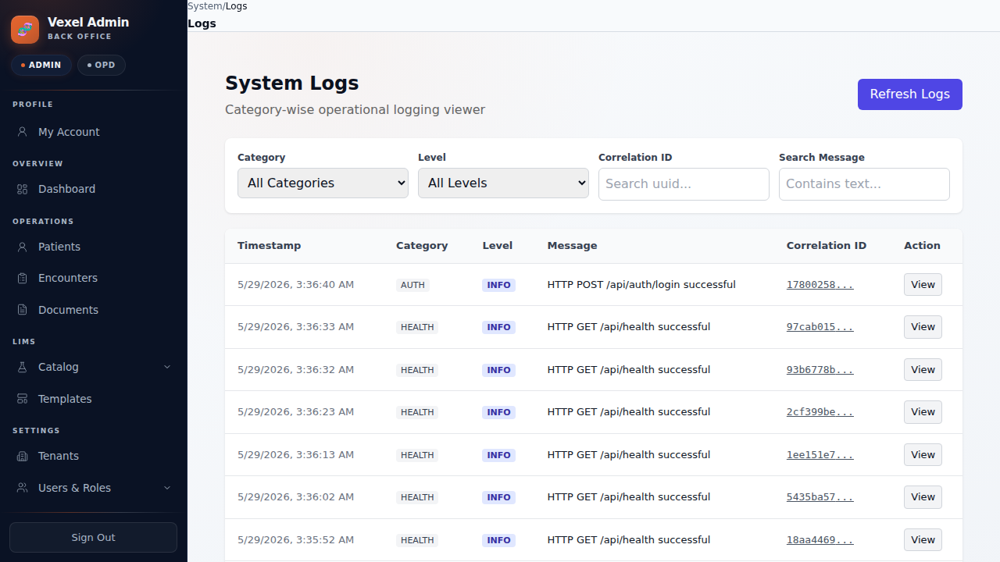
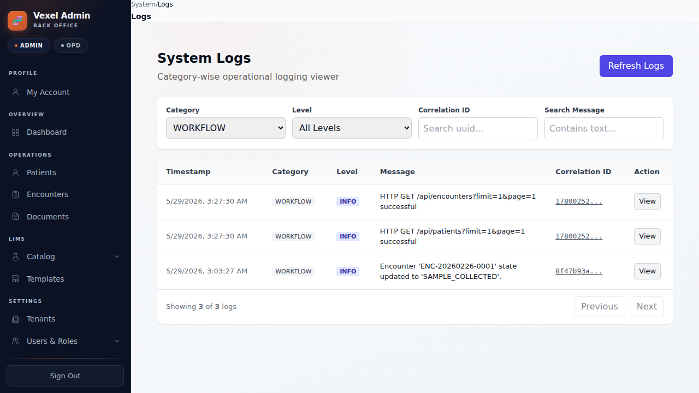
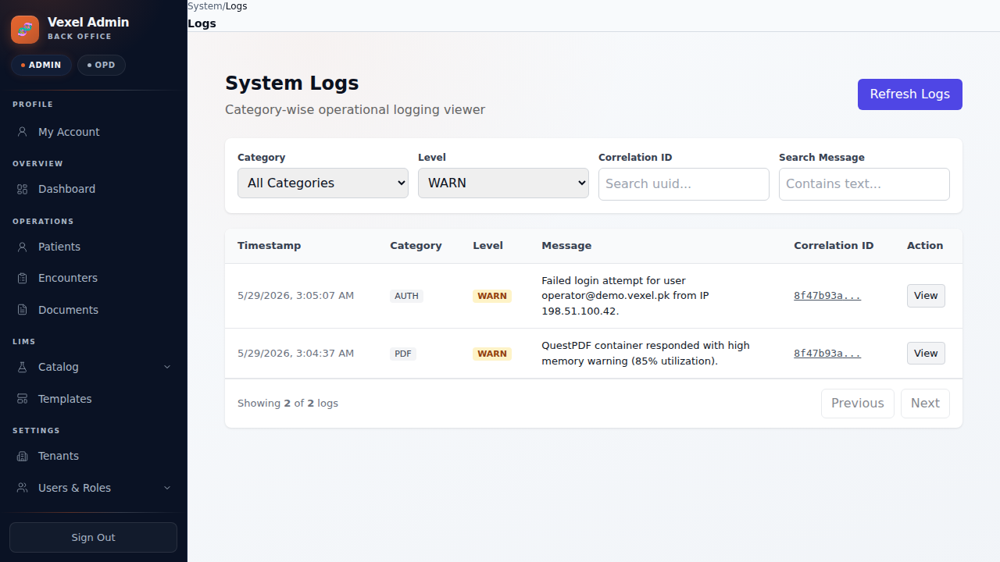
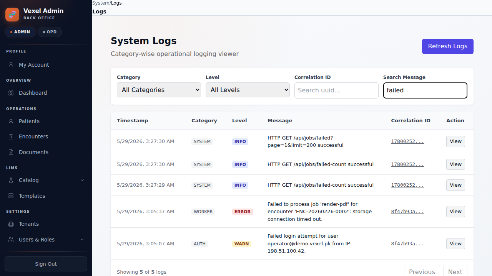
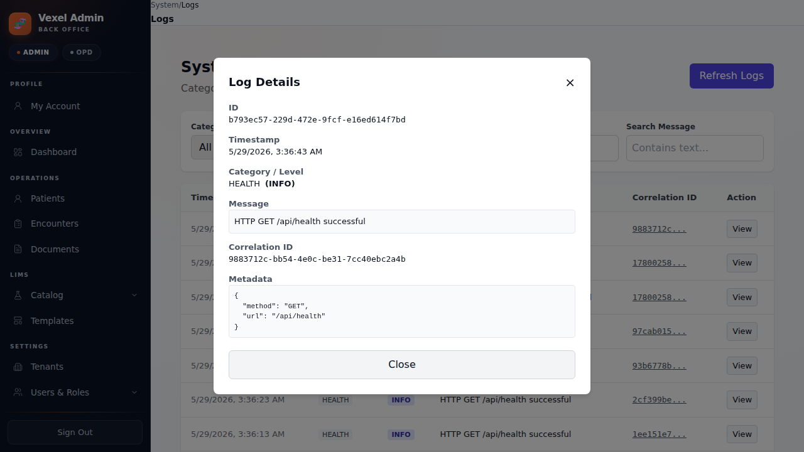
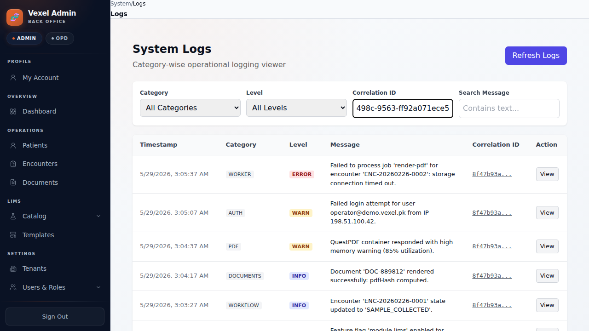

# 04. Log Viewer UI Verification

## Overview
The Admin Portal includes a specialized **System Logs Viewer** under `/admin/system/logs`. It fetches data in real-time from the backend, supporting category filtering, severity levels, free-text search, and cross-system correlation ID tracing.

## Visual Verification Screenshots
Below are the screenshots captured during the E2E verification flow:

### 1. Default Recent Logs View
Shows the default loaded state containing all seeded categories and operational logs sorted in reverse chronological order.

### 2. Category Filter
Demonstrates logs filtered by the selected `WORKFLOW` category.

### 3. Severity Level Filter
Filters the logs to display warnings and errors (e.g. `WARN` level selected).

### 4. Free-text Search
Filters logs containing the search term "failed", dynamically returning matching events.

### 5. Log Details Modal
Shows the detailed modal view triggered by clicking the "View" action button. The modal displays complete JSON metadata and parameters.

### 6. Correlation ID Trace
Filtering by a specific correlation ID (`8f47b93a-86c2-498c-9563-ff92a071ece5`) displays the entire unified transaction history spanning multiple services (Worker, Auth, PDF, Workflow, etc.).

