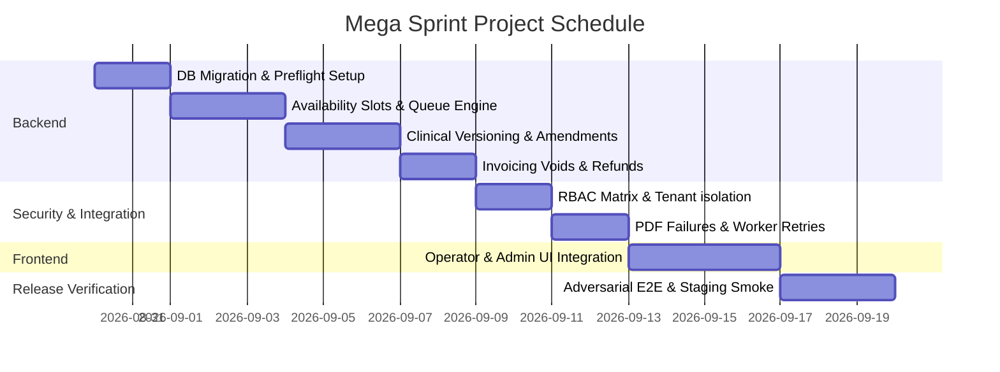

# Technical Execution Plan — OPD Mega Sprint

This document defines the technical execution plan to implement all remaining OPD canonical milestones in a single, continuous run. It incorporates the architectural decisions confirmed by the release owner.

---

## 🎯 1. Confirmed Design Choices

1. **Scheduling Timezones**: Timezone offsets and availability slots will be calculated using native JavaScript `Intl` and `Date` APIs to avoid adding heavy external dependencies.
2. **Clinical Versioning**: Clinical note versioning and amendments will be handled via row-duplication in the `OpdNote` table using an incremented `version` column. The active note is defined as the row with the highest version and `status = "SIGNED"`.
3. **Configuration Storage**: Configurable limits (like `refundMaxLimitPct` and `queueRule`) will be stored in a dedicated database model: `OpdSettings` in the Prisma schema.
4. **PDF Failure Testing**: Test-only PDF rendering failures will be triggered by passing a request header: `X-Test-Inject-Pdf-Failure: true` to the PDF worker queue.

---

## 🗃️ 2. Database Schema Changes (`schema.prisma`)

We will update the schema to introduce `OpdSettings`, refactor `OpdNote` constraints, and version `OpdEncounterPrescription`.

```prisma
// ─── OPD settings configuration ──────────────────────────────────────────
model OpdSettings {
  id                 String   @id @default(uuid())
  tenantId           String   @unique
  refundMaxLimitPct  Int      @default(100)
  queueRule          String   @default("CHECK_IN_TIME") // Default FCFS by check-in time
  retentionYears     Int      @default(3)
  createdAt          DateTime @default(now())
  updatedAt          DateTime @updatedAt

  tenant             Tenant   @relation(fields: [tenantId], references: [id], onDelete: Cascade)

  @@map("opd_settings")
}

// ─── Versioned Clinical Notes (Row Duplication) ──────────────────────────
model OpdNote {
  id                String    @id @default(uuid())
  tenantId          String
  opdEncounterId    String
  historyNotes      String?
  examNotes         String?
  assessment        String?
  plan              String?
  advice            String?
  diagnosis         String?
  followUp          String?
  investigations    String?
  remarks           String?
  status            String    @default("DRAFT") // DRAFT | SIGNED | AMENDED_DRAFT
  signedAt          DateTime?
  signedBy          String?
  version           Int       @default(1)
  amendmentReason   String?
  amendedById       String?
  amendmentStatus   String?   // PENDING | APPROVED | REJECTED
  updatedAt         DateTime  @updatedAt
  createdAt         DateTime  @default(now())

  tenant       Tenant       @relation(fields: [tenantId], references: [id])
  opdEncounter OpdEncounter @relation(fields: [opdEncounterId], references: [id], onDelete: Cascade)

  // Composite unique constraint replaced: allows multiple rows per encounter with unique versions.
  @@unique([tenantId, opdEncounterId, version])
  @@index([tenantId, updatedAt])
  @@map("opd_notes")
}

// ─── Versioned Prescriptions ──────────────────────────────────────────────
model OpdEncounterPrescription {
  id                  String   @id @default(uuid())
  tenantId            String
  opdEncounterId      String
  version             Int      @default(1)
  status              String   @default("DRAFT") // DRAFT | PUBLISHED
  publishedDocumentId String?
  createdAt           DateTime @default(now())
  updatedAt           DateTime @updatedAt

  tenant       Tenant                    @relation(fields: [tenantId], references: [id])
  opdEncounter OpdEncounter              @relation(fields: [opdEncounterId], references: [id], onDelete: Cascade)
  items        OpdPrescriptionItemKmvp[]

  @@unique([tenantId, opdEncounterId, version])
  @@index([tenantId, createdAt])
  @@map("opd_prescriptions_kmvp")
}
```

---

## 📅 3. Milestone-by-Milestone Implementation Plan



### Milestone 1: DB Preflight, Safeguard, and Migration
1. **Preflight Row Audit**:
   - Write `apps/api/prisma/preflight.ts` to count and verify all records in current models (`OpdEncounter`, `OpdDoctor`, `OpdSchedule`, etc.).
2. **Rollback Rehearsal Script**:
   - Write a shell script `scripts/db-backup-test.sh` to trigger a Postgres logical dump, restore it to a secondary database instance `vexel_test_restore`, run schema validation, and delete the secondary instance upon completion.
3. **Database Migration**:
   - Deploy migration applying schema changes (adding `OpdSettings`, altering `OpdNote` constraints, adding version column in `OpdEncounterPrescription`).

### Milestone 2: Timezone-Aware Slot Generator & Queue Engine
1. **Timezone Math (Native Intl)**:
   - Implement timezone and DST calculations within `OpdService` using native `Intl.DateTimeFormat` (e.g. evaluating doctor's availability using localized timezone parameters).
   - Expose endpoint `GET /opd/doctors/:doctorId/slots` returning 15-minute intervals.
2. **Patient Queue (Check-in Timing)**:
   - Configure queue sorting based on the appointment/encounter `checkedInAt` timestamp.
   - Expose endpoint `GET /opd/encounters/queue` sorting active encounters dynamically by check-in order.
3. **Transaction Registry**:
   - Link appointments to encounters atomically during check-in: update `OpdAppointment.status` to `CHECKED_IN` and create the `OpdEncounter` referencing the appointment within a single Prisma transaction block.

### Milestone 3: Clinical Versioning workspace
1. **Draft Note Workspace**:
   - Allow saving of clinical note versions with `status = "DRAFT"` or `status = "AMENDED_DRAFT"`.
   - Prevent modifications if the selected version is already marked as `SIGNED`.
2. **Note Amendment Request & Approvals**:
   - When a note is signed and needs editing:
     - `POST /opd/commands/requestNoteAmendment` creates a new note row duplicating the fields, incrementing the `version`, setting `status = "AMENDED_DRAFT"`, and setting `amendmentStatus = "PENDING"`.
     - `POST /opd/commands/approveNoteAmendment` changes the new row status to `SIGNED` and `amendmentStatus = "APPROVED"`.
   - Ensure the `OpdEncounter` resolver returns the highest version note that has status `SIGNED`.
3. **Clinician-User Ownership Guard**:
   - Validate that `OpdDoctor.userId === currentAuthenticatedUser.id` before allowing the doctor to sign or draft notes.

### Milestone 4: Financial Controls
1. **Settings configuration**:
   - Provide a setup endpoint `PATCH /opd/settings` to update `refundMaxLimitPct` and `retentionYears` dynamically (restricted to Admin roles).
2. **Invoicing Commands**:
   - `POST /opd/billing/invoices/:id/void` - marks invoice as void, cancels balance due, and logs an audit trail.
   - `POST /opd/billing/invoices/:id/refund` - accepts a refund amount.
3. **Concurrency Locks**:
   - Execute `SELECT * FROM invoices WHERE id = $1 FOR UPDATE` inside `recordPayment` and `refund` database transactions to prevent race conditions during concurrent entries.
   - Apply user-specified configurable limits check: if the requested refund exceeds `refundMaxLimitPct`, reject with `400 Bad Request` unless signed off by an Admin payload parameter.

### Milestone 5: Least-Privilege RBAC & Isolation
1. **Adversarial Tenant Separation**:
   - Write automated unit tests trying to query/mutate data with incorrect header `X-Tenant-Id` or JWTs belonging to a different tenant. Every endpoint must return `404` or `403` silently.
2. **Role Profiles**:
   - Add default users in seed script representing front desk, clinician, and admin personas.

### Milestone 6: PDF Worker Resiliency
1. **Failure Injection**:
   - Intercept PDF generation logic: if header `X-Test-Inject-Pdf-Failure` is present, throw a mock render error.
2. **Worker Retries & Log**:
   - Assert BullMQ catches the failure, increments retry attempts, and writes the status `FAILED` in the database, updating it to `RENDERED` upon a successful subsequent retry.

### Milestone 7: Frontends parity
1. **Operator Panels**:
   - Wire registration checkout and doctor scheduling widgets to use the generated SDK.
   - Add a clinical consultation notes form showing previous note versions, amendment histories, and draft/sign options.
2. **Admin Observability**:
   - Render doctor schedule tables and timezone options.
   - List pending note amendment requests and provide the Admin approval/rejection button panel.

### Milestone 8: Full-Stack Verification & Release
1. **Host-Based Route Testing**:
   - Configure local Caddyfile to route domains dynamically.
   - Run the complete Playwright E2E suite under all three personas (front desk, clinician, and admin).
2. **Vulnerability Remediation**:
   - Run dependency scans (`npm audit`) and update vulnerable third-party modules.
3. **Sign-off**:
   - Re-evaluate checklist and update [`OPD_RELEASE_READINESS.md`](OPD_RELEASE_READINESS.md) to `Decision: OPD PRODUCTION READY`.
